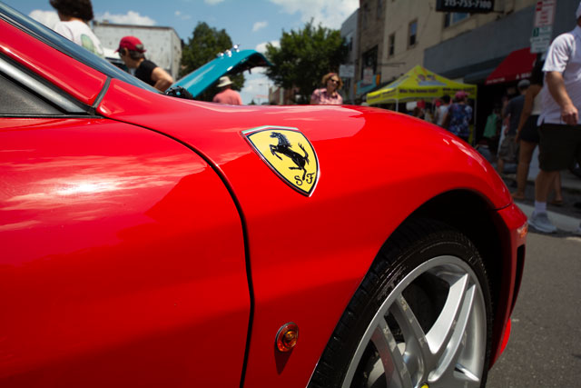
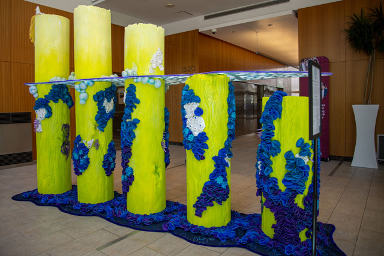

# Components

## Grid Hero Component
This component is used for the main hero grid component.

**HTML Code**
```
<div class="hero-seciton">
                <div class="hero-item"><a href="portfolio.html">
                        <h2>Portfolio</h2>
                        
                    </a>
                </div>
```

**CSS Code**
```
.hero-seciton {
    display: grid;
    grid-template-columns: 1fr;

    @media screen and (width >=700px) {
        display: grid;
        grid-template-columns: 1fr 1fr;
        gap: 1rem;
    }
}
```

**Example:**
<div class="hero-seciton">
                <div class="hero-item"><a href="portfolio.html">
                        <h2>Portfolio</h2>
                        
                    </a>
                </div>

## Responsive Images
This code is used for responsive images. The first line, the src is a backup for older browsers.
```

```
**Example:**

